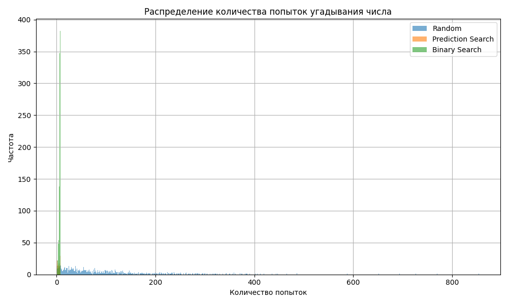

# 🎯 Проект 0: Угадай число

## 📌 Описание проекта
Учебный проект на Python, в котором реализована игра **«Угадай число»** несколькими способами:
- 👤 Вручную — пользователь вводит число с подсказками.
- 🤖 Алгоритмически — компьютер сам подбирает число:
  - случайным образом
  - случайным образом с коррекцией
  - бинарным поиском (авторская реализация)

---

## 💡 Какой кейс решаем?
Проект решает задачи:
- изучения основ Python: условия, циклы, функции;
- сравнения эффективности разных стратегий угадывания;
- визуализации статистических данных;

---

## 📊 Краткая информация о данных
- Загаданное число выбирается случайно от 1 до 100.
- Каждый алгоритм тестируется на **1000 случайных чисел**.
- Метрика — **среднее количество попыток до угадывания**.

---

## 🛠️ Этапы работы над проектом

### 1. Ручная игра
Пользователь вводит числа, а программа подсказывает: больше или меньше.

### 1. Автоматическая игра(через алгоритмы)
Программа сама угадывает число разными методами:

### Подход 1: Случайное угадывание
Число подбирается случайно на каждой итерации. Эффективность низкая — алгоритм не запоминает предыдущие попытки.

### Подход 2: Угадывание с коррекцией
Простой алгоритм, который корректирует предполагаемое число в зависимости от того, больше оно или меньше загаданного. Работает быстрее случайного метода, но не идеально стабилен.

### Подход 3: Моё решение (бинарный алгоритм с коррекцией)
Это реализация с применением бинарного поиска, но со встроенной логикой коррекции границ и стабилизации шагов.
Алгоритм делит диапазон пополам, отсекая лишнее. Быстрый и эффективный: угадывает максимум за 7 шагов.
- Добавлены графики распределения и boxplot.
- Оформлено как полноценное аналитическое мини-исследование в Google Colab.

---

## 📈 Результаты

| Алгоритм              | Среднее | Макс. | Мин. |
|-----------------------|---------|-------|------|
| 🔢 Подход 1: Случайное угадывание  | 100   | 854   | 1    |
| 🔍 Подход 2: Угадывание с коррекцией | 32   | 99     | 1    |
| 🧠 Подход 3: Бинарный алгоритм с коррекцией | 6   | 7     | 1    |

_Мой алгоритм (Подход 3) демонстрирует наилучшие результаты по сравнению с двумя предыдущими: меньшее среднее количество попыток и более узкое распределение._

---

## 📉 Визуализация

_Ниже представлено сравнение трёх подходов. Особенно заметно преимущество моей реализации по стабильности и минимальному разбросу значений._

---

## 📎 Файлы в репозитории

| Файл | Описание |
|------|----------|
| [`guessing_game.py`](https://github.com/agabaevroman/data_science/blob/main/project_0/guessing_game.py) | Ручная игра |
| [`auto_guessing_game.py`](https://github.com/agabaevroman/data_science/blob/main/project_0/auto_guessing_game.py) | Алгоритм случайного угадывания |
| [`correction_guessing_game.py`](https://github.com/agabaevroman/data_science/blob/main/project_0/correction_guessing_game.py) | Угадывание с коррекцией |
| [`binary_guessing_game.py`](https://github.com/agabaevroman/data_science/blob/main/project_0/binary_guessing_game.py) | Бинарный алгоритм с коррекцией + график |
| [`attempts_distribution.png`](https://github.com/agabaevroman/data_science/blob/main/project_0/attempts_distribution.png) | График сравнения алгоритмов |
| [`requirements.txt`](https://github.com/agabaevroman/data_science/blob/main/project_0/requirements.txt) | Версии библиотек |
| [`Colab-проект`](https://colab.research.google.com/drive/1h1-4_EuopQUlP5aNHmRNWiK8IgCFm0cu?usp=sharing) | Ноутбук с визуализациями и кодом |
